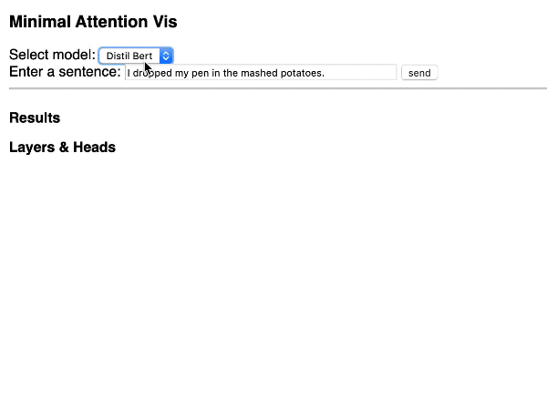

# Interactive Attention Visualization

A small example of an interactive visualization for attention values
as being used by transformer language models like GPT2 and BERT.

by [Hendrik Strobelt](http://hendrik.strobelt.com) and [Sebastian Gehrmann](https://scholar.harvard.edu/gehrmann/home) 
for the [SIDN IAP class at MIT](http://sidn.csail.mit.edu), Jan 2020 


<p align="center">
  
</p>

## Preparation
- Install Anaconda or [Miniconda](https://docs.conda.io/en/latest/miniconda.html)
- run `conda env create -f environment.yml` to create a new environment called `attnvis`

## Running the demo
- activate conda environment: `conda activate attnvis`
- run server: `python server.py`
- visit [http://localhost:8888/](http://localhost:8888/)

## Structure
```text
api.py             -- contains the interface to the pytorch/huggingface backend 
server.py          -- defines a REST interface for the api.py calls

client/*           -- contains all client files
client/index.html  -- main file including JS code
client/styles.css  -- all CSS styles defined in here
client/tools.js    -- helper functions
```

## Libraries used
- [Huggingface pytorch transformer](https://huggingface.co/) for models
- [Flask Python](http://flask.palletsprojects.com/) for REST interface
- [D3js](https://d3js.org/) for javascript DOM manipulation

## Thanks
Thanks to Ben Hoover for testing the code. Supported by [MIT-IBM Watson AI Lab](https://mitibmwatsonailab.mit.edu/). 


 
